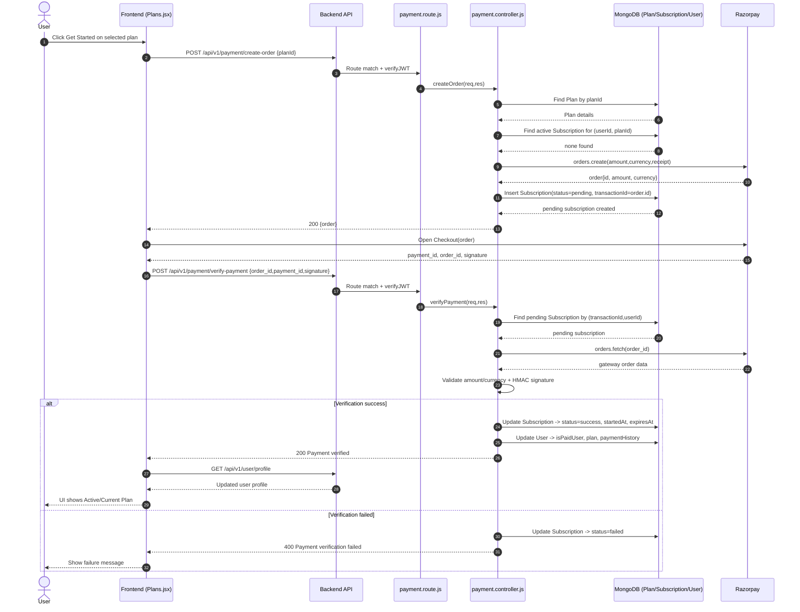

# GeoFence Subscription Hardening - Implementation Document (docs_3)

## 1. Purpose
This document captures the full set of changes implemented to harden subscription, payment verification, and entitlement enforcement in the GeoFence project.

The implementation goal was to move from UI-level checks to backend-enforced, production-oriented controls.

---

## 2. Scope of Work Completed

### In Scope
1. Harden payment creation and verification flow.
2. Introduce centralized entitlement resolution.
3. Enforce subscription and plan features at backend route/controller level.
4. Synchronize user subscription state after successful payment.
5. Add database indexes for frequent subscription lookups.
6. Validate compile/start/build status after changes.

### Out of Scope (Not Implemented Yet)
1. Razorpay webhook reconciliation endpoint.
2. Automated integration tests for payment lifecycle.
3. Full frontend lint cleanup unrelated to subscription flow.

---

## 3. High-Level Architecture Changes

### Before
1. Subscription checks existed primarily in payment order creation.
2. Feature usage controls (forms/uploads/geofence/response limits) were not consistently enforced server-side.
3. Payment verify flow lacked strict idempotent and order-value validation.

### After
1. Entitlement is resolved centrally from active subscription records.
2. Backend enforces active subscription and feature-level checks.
3. Payment verify is stricter, idempotent-aware, and updates user plan state.
4. Form and response limits are enforced from plan features at API level.

---

## 4. Files Added

### 4.1 backend/src/services/subscription.service.js
Added shared service utilities:
1. getActiveSubscriptionWithPlan(userId)
2. getEntitlementForUser(userId)
3. getExpiryFromInterval(interval, fromDate)
4. normalizeUserPlan(planName)

Key behavior:
1. Resolves active subscription as status=success and expiresAt > now.
2. Populates plan document for feature checks.
3. Computes expiry based on plan interval (monthly/yearly).
4. Normalizes plan labels to supported user plan values (free/basic/pro).

### 4.2 backend/src/middlewares/subscription.middleware.js
Added middleware layer:
1. attachEntitlement
2. requireActiveSubscription
3. requireFeature(featureName)

Key behavior:
1. Attaches entitlement to request for downstream checks.
2. Blocks access when no active subscription.
3. Blocks access when required feature is unavailable in current plan.

---

## 5. Files Updated

### 5.1 backend/src/controllers/payment.controller.js
Implemented payment hardening and state sync.

Changes:
1. Added User model usage to update user paid state after verify success.
2. Added service imports for expiry and plan normalization.
3. createOrder now:
   - Uses authenticated user _id safely.
   - Uses plan currency for order options.
   - Uses async/await for Razorpay order creation.
   - Creates pending subscription with gateway=razorpay.
4. verifyPayment now:
   - Validates input payload presence.
   - Finds pending subscription by transactionId + userId.
   - Supports idempotent success response if already verified.
   - Fetches Razorpay order and validates amount/currency mismatch.
   - Uses timing-safe signature comparison (length-safe).
   - Marks failed on mismatch/signature failure.
   - Updates subscription status to success with interval-based expiry.
   - Updates user isPaidUser, plan, and paymentHistory.
5. Receipt format was shortened to reduce gateway validation risk.

### 5.2 backend/src/controllers/form.controller.js
Added server-side entitlement enforcement for form lifecycle.

Changes:
1. Requires active entitlement during createForm/updateForm.
2. Enforces maxForms from plan features.
3. Blocks geofence usage when allowGeofence is false.

### 5.3 backend/src/controllers/response.controller.js
Added plan-based response-cap check.

Changes:
1. Resolves form owner entitlement.
2. Enforces maxResponses per form from owner plan features before accepting submission.

### 5.4 backend/src/routes/user.routes.js
Applied middleware to protected endpoints.

Changes:
1. create-form route now requires active subscription.
2. update form route now requires active subscription.
3. upload route now requires:
   - verifyJWT
   - attachEntitlement
   - requireFeature("allowFileUpload")

Security impact:
1. Upload endpoint is no longer effectively open for unauthenticated usage.

### 5.5 backend/src/models/subscription.model.js
Added indexes for performance and lookup patterns.

Changes:
1. index({ userId: 1, status: 1, expiresAt: -1 })
2. index({ userId: 1, plan: 1, status: 1, expiresAt: -1 })

### 5.6 frontend/src/pages/Plans.jsx
Improved frontend state sync post-payment verification.

Changes:
1. Uses fetchProfile from auth context after verify-payment success.
2. Ensures UI reflects latest plan state immediately after successful verification.

---

## 6. End-to-End Behavior After Implementation

### Order Creation
1. Authenticated user requests order with planId.
2. Backend validates plan exists.
3. Backend checks duplicate active subscription for same plan.
4. Backend creates Razorpay order.
5. Backend creates pending subscription row tied to order id.

### Payment Verification
1. Frontend sends razorpay_order_id, razorpay_payment_id, razorpay_signature.
2. Backend validates payload and pending state.
3. Backend validates amount/currency by fetching order from gateway.
4. Backend verifies signature.
5. On success:
   - subscription status set to success
   - startedAt/expiresAt set from interval
   - user paid state and plan updated
   - payment history appended
6. On failure:
   - pending subscription marked failed

### Feature Enforcement
1. Form creation/update requires active subscription.
2. Geofence form settings allowed only when plan permits.
3. Upload requires allowFileUpload feature.
4. Response creation blocks when maxResponses limit is reached.
5. Form creation blocks when maxForms limit is reached.

---

## 7. Validation and Test Evidence

### Commands/Checks Run
1. Frontend production build: passed.
2. Backend syntax checks on all changed files: passed.
3. Backend startup smoke test: passed (server started and DB connected).
4. Diagnostics check on changed files: no backend compile issues found.

### Known Existing Project-Wide Issues (Pre-existing)
1. Frontend lint has multiple errors in map/header/auth and other files unrelated to this subscription patch.
2. These lint errors do not block production build currently.

---

## 8. Risk and Limitations

1. No webhook reconciliation yet:
   - Client callback/verify path works, but asynchronous gateway events are not yet reconciled server-to-server.
2. Integration tests not yet automated:
   - Manual or scripted API tests are still recommended for regression safety.
3. User plan normalization currently maps by plan name patterns:
   - Works for free/basic/pro naming conventions.
   - If naming diverges heavily, normalization should be adjusted.

---

## 9. Recommended Next Steps

1. Add Razorpay webhook endpoint and signature verification for reconciliation.
2. Add integration tests for:
   - create-order happy path
   - duplicate purchase block
   - verify-payment success/failure/idempotent path
   - feature gate denial for non-entitled users
3. Add endpoint to fetch current entitlement summary for frontend display.
4. Clean frontend lint baseline and enforce CI checks.

---

## 10. Change Summary (Quick)

1. Added centralized entitlement service and middleware.
2. Hardened payment verification and user subscription synchronization.
3. Enforced subscription features server-side on forms/uploads/responses.
4. Added subscription query indexes.
5. Updated plans UI refresh after successful verify-payment.

This completes the detailed documentation for the previous implementation.

---

## 11. Detailed Flow (Step-by-Step)

### 11.1 Subscription Purchase Flow (Frontend + Backend)

1. User opens plans page and selects a plan.
2. Frontend calls POST /api/v1/payment/create-order with planId and cookie session.
3. Backend verifies JWT and reads user identity.
4. Backend fetches plan details and checks existing active subscription for same plan.
5. Backend creates Razorpay order.
6. Backend creates Subscription record with status=pending and transactionId=order.id.
7. Backend returns order payload to frontend.
8. Frontend opens Razorpay checkout using returned order data.
9. Razorpay returns order_id, payment_id, and signature to frontend handler.
10. Frontend calls POST /api/v1/payment/verify-payment with Razorpay payload.
11. Backend validates payload fields.
12. Backend looks for pending subscription by transactionId + userId.
13. Backend handles idempotent case if already success.
14. Backend fetches order from Razorpay and validates amount/currency.
15. Backend validates signature using HMAC SHA256 and timing-safe compare.
16. On success:
   - set subscription status=success
   - set startedAt and expiresAt from plan interval
   - update user isPaidUser and normalized plan
   - append paymentHistory entry
17. Frontend receives success and calls fetchProfile.
18. UI updates current plan badge and disables active plan purchase button.

### 11.2 Feature Access Flow (Create/Update Form)

1. Frontend calls protected route (create-form or update form).
2. Backend verifyJWT resolves logged-in user.
3. requireActiveSubscription middleware (route-level) ensures active plan exists.
4. Controller resolves entitlement (or reuses req.entitlement) and plan features.
5. Controller applies business rules:
   - maxForms limit check on create
   - allowGeofence check when geofence is present in payload
6. Request is accepted only if entitlement and limits pass.

### 11.3 Feature Access Flow (Upload)

1. Frontend uploads file to POST /api/v1/user/upload.
2. Backend verifyJWT authenticates user.
3. attachEntitlement loads active subscription + plan features.
4. requireFeature("allowFileUpload") enforces feature entitlement.
5. Only entitled users proceed to multer and cloudinary upload logic.

### 11.4 Response Submission Limit Flow

1. User submits response to a form.
2. Backend loads target form and verifies isActive.
3. Backend resolves form owner entitlement from active subscription.
4. Backend checks maxResponses limit from owner plan features.
5. If current total responses >= maxResponses, backend rejects submission.
6. Otherwise backend continues existing form rules (submissionLimitPerUser, geofence, time window) and stores response.

### 11.5 Failure Handling Flow

1. Missing/invalid payment verify payload: rejected with 400.
2. No pending subscription for order and not already success: rejected with 404.
3. Amount/currency mismatch against gateway order: subscription marked failed and request rejected.
4. Signature mismatch: subscription marked failed and request rejected.
5. No active subscription on protected routes: rejected with 403.
6. Missing feature entitlement: rejected with 403.

### 11.6 Data State Transitions

Subscription:
1. pending -> success after verified payment.
2. pending -> failed on amount/currency mismatch.
3. pending -> failed on signature mismatch.

User:
1. isPaidUser false -> true on successful payment verification.
2. plan free/basic/pro updated from normalized subscribed plan.
3. paymentHistory receives appended successful payment record.

---

## 12. Plan Purchase Code Flow with Diagram

### 12.1 Code-Level Flow (Execution Path)

1. Frontend plan action starts in frontend/src/pages/Plans.jsx:
   - onPayment(planId) sends POST /api/v1/payment/create-order.
2. Backend route backend/src/routes/payment.route.js maps create-order to createOrder with verifyJWT.
3. Controller backend/src/controllers/payment.controller.js:createOrder:
   - reads req.user._id and req.body.planId
   - validates plan from Plan model
   - checks existing active subscription for same plan
   - creates Razorpay order
   - stores pending Subscription with transactionId=order.id
   - returns order payload
4. Frontend opens Razorpay Checkout using order data.
5. Razorpay handler returns:
   - razorpay_order_id
   - razorpay_payment_id
   - razorpay_signature
6. Frontend sends POST /api/v1/payment/verify-payment.
7. Backend route backend/src/routes/payment.route.js maps verify-payment to verifyPayment with verifyJWT.
8. Controller backend/src/controllers/payment.controller.js:verifyPayment:
   - validates payload presence
   - finds pending Subscription by transactionId + userId
   - handles idempotent already-success case
   - fetches gateway order and validates amount/currency
   - verifies HMAC signature
   - on success updates Subscription to success with expiry from interval
   - updates User (isPaidUser, plan, paymentHistory)
9. Frontend receives success and calls fetchProfile from auth context.
10. Plans page re-renders with updated current plan state.

### 12.2 Mermaid Sequence Diagram (Plan Purchase)

### 12.3 Decision Points in Flow

1. Duplicate active plan check (createOrder): prevents repurchase of already active same plan.
2. Pending record existence (verifyPayment): ensures verify is bound to created order lifecycle.
3. Amount/currency validation: prevents payload tampering/mismatch acceptance.
4. Signature validation: cryptographic proof from gateway.
5. Idempotent verify behavior: avoids duplicate side effects on repeated callbacks.
